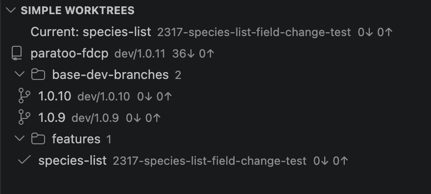

# Simple Worktrees

A minimal git **worktree manager** that lives in the Source Control view. Create
worktrees and jump between them without leaving VS Code.



Each row shows the worktree name, its branch, and the upstream commit counts
(`36↓ 0↑`). Worktrees can be organised into collapsible groups; the currently
open worktree is marked with a ✓.

## Features

- **Create a worktree** with the `+` button in the view title.
  - Asks for a folder name, then lets you pick a branch.
  - Created next to the main checkout using the `<repo>.worktrees/<name>` layout
    (e.g. `paratoo-fdcp.worktrees/species-list`) — no folder picker needed.
  - Pick an existing local branch, check out a remote branch (a local tracking
    branch is created automatically), or create a brand-new branch. Creating a
    new branch asks for the base branch first, then the name — matching VS Code's
    own "Create Branch From…" flow.
- **Compact list** — each row shows the worktree name, its branch, and the
  upstream commit counts (`36↓ 0↑` = behind ↓ / ahead ↑, just like the status
  bar). Hover for the full path, HEAD, upstream, and lock/main status.
- **Current worktree at a glance** — the worktree open in this window is marked
  with a ✓, and a `Current: <name>` summary row is pinned to the top of the view
  so you can see which worktree (and branch) you're in without scanning the list.
- **Pull / push from the row** — when a worktree is behind or ahead of its
  upstream, hover to reveal a ↓ (pull) or ↑ (push) button. Each asks for
  confirmation, then runs git **in that worktree's folder** — so you can pull or
  push any worktree's branch without switching to it.
- **Groups** — organise large numbers of worktrees (features, bugfixes,
  hotfixes…) into collapsible groups:
  - `New Group` button in the view title, or **Add to Group** on a worktree
    (also offers "New group…" inline).
  - **Drag and drop** worktrees between groups, drop onto empty space to
    ungroup, and drag a group header to reorder. Or use the context menu:
    Rename / Delete group, Move Up / Down, Remove from Group.
  - Groups appear below the ungrouped worktrees, and each group's
    collapsed/expanded state is remembered per repository — collapse a big group
    once and it stays collapsed when you open another worktree of the same repo.
  - Grouping is metadata only — it never touches your worktrees or branches.
    Deleting a group just moves its worktrees back to ungrouped. Groups are
    stored per repository and shared across every window/worktree of that repo.
- **Open on click** — opens that worktree in the current window. Right-click (or
  the inline icon) to open it in a new window, copy its path, or remove it.
- **Refresh** button, plus automatic refresh after a worktree is created, when
  repositories open or close, and on a timer while the view is visible — so
  externally-made changes (a new worktree, a branch switch, fresh commit counts)
  show up on their own. Interval is configurable via
  `simpleWorktrees.refreshInterval` (seconds; `0` disables it).

## How creating works

The flow maps directly to git:

| You choose                | Command run                                                  |
| ------------------------- | ------------------------------------------------------------ |
| Existing local branch     | `git worktree add <path> <branch>`                           |
| Remote branch (no local)  | `git worktree add --track -b <branch> <path> <remote/branch>`|
| Create new branch         | `git worktree add -b <branch> <path> [<base>]`               |

A branch already checked out in another worktree can't be reused — git allows a
branch in only one worktree at a time, so those entries are flagged.

## Development

```bash
npm install
npm run compile     # or: npm run watch
npm test            # run the unit tests
```

Press <kbd>F5</kbd> (Run Simple Worktrees) to launch an Extension Development
Host. Open a folder that is part of a git repository to see the view under
**Source Control**.

### Tests

Unit tests run in plain Node (no VS Code host) via Mocha, with `require('vscode')`
redirected to a small in-memory mock (`src/test/mocks/vscode.ts`). They cover the
parts most likely to break when adding features:

- `worktrees` — parsing `git worktree list` / upstream tracking output.
- `groupStore` — group CRUD, per-repo isolation, assignments, ordering,
  collapsed-state persistence.
- `repos` — collapsing worktrees of the same repo to one entry.
- `treeProvider` — tree shape (ungrouped-then-groups), counts, grouped flags,
  collapse state, and drag-and-drop assignment/reorder.

## Packaging a `.vsix`

Build a distributable `.vsix` with [`@vscode/vsce`](https://github.com/microsoft/vscode-vsce):

```bash
# one-off, no global install needed
npx @vscode/vsce package
```

This compiles the extension (via the `vscode:prepublish` script) and writes
`simple-worktrees-<version>.vsix` to the project root.

> If you haven't filled in a `publisher` you can pass `--allow-missing-repository`
> or just ignore the warnings — they don't affect local installs.

## Installing from the `.vsix`

Pick either approach:

**From the command line**

```bash
code --install-extension simple-worktrees-0.0.1.vsix
```

**From the VS Code UI**

1. Open the **Extensions** view (<kbd>⇧⌘X</kbd> / <kbd>Ctrl+Shift+X</kbd>).
2. Click the **`...`** menu in the top-right → **Install from VSIX…**.
3. Select the generated `.vsix` file.

Reload the window if prompted. The **Simple Worktrees** view then appears under
**Source Control** in any window that has a git repository open.

To update later, bump `version` in `package.json`, re-run `vsce package`, and
install the new `.vsix` the same way (it replaces the old one). Uninstall from
the Extensions view like any other extension.

## Publishing to the Marketplace

The manifest is Marketplace-ready (icon, categories, repository, changelog). To
publish you need a one-time setup:

1. Create a publisher and an Azure DevOps **Personal Access Token** with the
   *Marketplace → Manage* scope — see the
   [official guide](https://code.visualstudio.com/api/working-with-extensions/publishing-extension).
2. Sign in: `npx @vscode/vsce login <publisher>` (the `publisher` in
   `package.json` is `nuwan`).
3. Publish: `npx @vscode/vsce publish` (or `vsce publish patch|minor|major` to
   bump the version at the same time).

## Requirements

- VS Code 1.84.0+
- The built-in Git extension (`vscode.git`) and `git` on your `PATH`.
