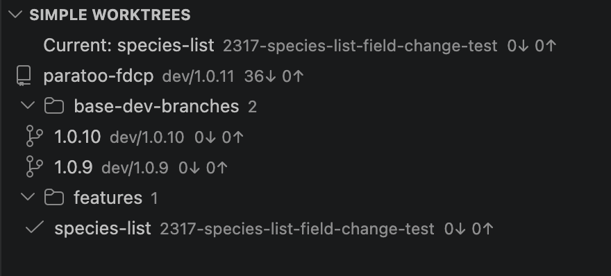

# Simple Worktrees

A minimal git **worktree manager** that lives in the Source Control view. Create
worktrees and jump between them without leaving VS Code.



Each row shows the worktree name, its branch, and the upstream commit counts
(`36↓ 0↑`). Worktrees can be organised into collapsible groups; the currently
open worktree is marked with a ✓.

## Features

- **Filter/search** with the 🔎 button in the view title. Type — or paste a
  branch name straight from elsewhere — and the list narrows live to worktrees
  whose name or branch matches, with the match bolded in the name. A "Clear
  Filter" button appears next to it while a filter is active. Groups and repo
  sections with no matches are hidden; the `Current:` summary always stays put.
- **Create a worktree** with the `+` button in the view title.
  - Asks for a folder name, then lets you pick a branch.
  - Created next to the main checkout using the `<repo>.worktrees/<name>` layout
    (e.g. `paratoo-fdcp.worktrees/species-list`) — no folder picker needed.
  - Pick an existing local branch, check out a remote branch (a local tracking
    branch is created automatically), or create a brand-new branch. Creating a
    new branch asks for the base branch first, then the name — matching VS Code's
    own "Create Branch From…" flow.
- **Compact list** — each row shows the worktree name, its branch, and the
  upstream commit counts (`36↓ 0↑` = behind ↓ / ahead ↑, just like the status
  bar). Hover for the full path, HEAD, upstream, and lock/main status.
- **Current worktree at a glance** — the worktree open in this window is marked
  with a ✓, and a `Current: <name>` summary row is pinned to the top of the view
  so you can see which worktree (and branch) you're in without scanning the list.
- **Pull / push from the row** — when a worktree is behind or ahead of its
  upstream, hover to reveal a ↓ (pull) or ↑ (push) button. Each asks for
  confirmation, then runs git **in that worktree's folder** — so you can pull or
  push any worktree's branch without switching to it.
- **Groups** — organise large numbers of worktrees (features, bugfixes,
  hotfixes…) into collapsible groups:
  - `New Group` button in the view title, or **Add to Group** on a worktree
    (also offers "New group…" inline).
  - **Drag and drop** worktrees between groups, drop onto empty space to
    ungroup, and drag a group header to reorder. Or use the context menu:
    Rename / Delete group, Move Up / Down, Remove from Group.
  - Groups are listed first, with the ungrouped worktrees below them, and each
    group's collapsed/expanded state is remembered per repository — collapse a
    big group once and it stays collapsed when you open another worktree of the
    same repo.
  - Grouping is metadata only — it never touches your worktrees or branches.
    Deleting a group just moves its worktrees back to ungrouped. Groups are
    stored per repository and shared across every window/worktree of that repo.
- **Open on click** — opens that worktree in the current window. Right-click (or
  the inline icon) to open it in a new window or copy its path.
- **Delete from the row** — hover a worktree to reveal a 🗑 button. It confirms
  first, showing the branch and path, and warns when the worktree has
  uncommitted or untracked changes so you can see what you'd lose. If git
  refuses (because of those changes), you're offered a force removal. The button
  is hidden on the main worktree, which git won't let you remove.
- **Rename from the row** — hover a worktree to reveal a ✏️ button, which prompts
  for a new folder name and moves the worktree there with `git worktree move`
  (keeping the branch and history intact, unlike a plain filesystem rename).
  Also hidden on the main worktree.
- **Refresh** button, plus automatic refresh after a worktree is created, when
  repositories open or close, and on a timer while the view is visible — so
  externally-made changes (a new worktree, a branch switch, fresh commit counts)
  show up on their own. Interval is configurable via
  `simpleWorktrees.refreshInterval` (seconds; `0` disables it).

## How creating works

The flow maps directly to git:

| You choose                | Command run                                                  |
| ------------------------- | ------------------------------------------------------------ |
| Existing local branch     | `git worktree add <path> <branch>`                           |
| Remote branch (no local)  | `git worktree add --track -b <branch> <path> <remote/branch>`|
| Create new branch         | `git worktree add -b <branch> <path> [<base>]`               |

A branch already checked out in another worktree can't be reused — git allows a
branch in only one worktree at a time, so those entries are flagged.

## Development

```bash
npm install
npm run compile     # or: npm run watch
npm test            # run the unit tests
```

Press <kbd>F5</kbd> (Run Simple Worktrees) to launch an Extension Development
Host. Open a folder that is part of a git repository to see the view under
**Source Control**.

### Tests

Unit tests run in plain Node (no VS Code host) via Mocha, with `require('vscode')`
redirected to a small in-memory mock (`src/test/mocks/vscode.ts`). They cover the
parts most likely to break when adding features:

- `worktrees` — parsing `git worktree list` / upstream tracking output.
- `groupStore` — group CRUD, per-repo isolation, assignments, ordering,
  collapsed-state persistence.
- `repos` — collapsing worktrees of the same repo to one entry.
- `treeProvider` — tree shape (ungrouped-then-groups), counts, grouped flags,
  collapse state, and drag-and-drop assignment/reorder.

## Packaging a `.vsix`

```bash
npm run package
```

Deletes any leftover `.vsix` from the project root, compiles (via
`vscode:prepublish`), and writes a fresh `simple-worktrees-<version>.vsix`.
Bump `version` in `package.json` first (and add a `CHANGELOG.md` entry) —
every packaged version here ends up installed and used.

## Installing from the `.vsix`

```bash
npm run release
```

Runs `npm run package`, then installs the freshly built `.vsix` with `code
--install-extension … --force`. **The `--force` matters**: VS Code pins a
gallery-installed extension to its Marketplace version, and a plain
`--install-extension` of a local `.vsix` gets silently reverted back to the
pinned version the next time VS Code reconciles extension state — it reports
success at install time, then quietly disappears. `--force` overrides the pin.

After running it, **reload the window** (`Cmd+Shift+P` → *Developer: Reload
Window*) — installing doesn't hot-swap an extension that's already loaded in a
running window. Check **Extensions → Simple Worktrees → Details** shows the
new version to confirm the reload picked it up.

You can also install manually: **Extensions** view (<kbd>⇧⌘X</kbd>) → **`...`**
menu → **Install from VSIX…** — but the same pin-revert risk applies without
`--force`; prefer `npm run release`.

## Publishing to the Marketplace

The manifest is Marketplace-ready (icon, categories, repository, changelog). To
publish you need a one-time setup:

1. Create a publisher and an Azure DevOps **Personal Access Token** with the
   *Marketplace → Manage* scope — see the
   [official guide](https://code.visualstudio.com/api/working-with-extensions/publishing-extension).
2. Sign in: `npx @vscode/vsce login <publisher>` (the `publisher` in
   `package.json` is `nuwan`).
3. Publish: `npx @vscode/vsce publish` (or `vsce publish patch|minor|major` to
   bump the version at the same time).

## Requirements

- VS Code 1.84.0+
- The built-in Git extension (`vscode.git`) and `git` on your `PATH`.
